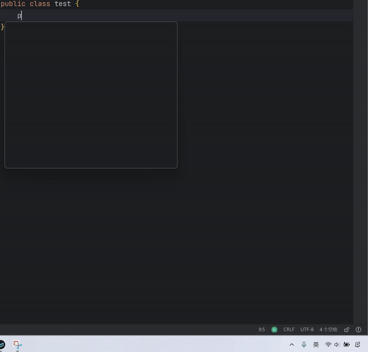

# Jetbrains IDEA 输入法自动切换插件

    目前只在IDEA上进行了测试，理论上插件在Jetbrains家和IDEA相似的IDE上都可以运行

## 相关博文

* [输入法自动切换插件阶段性总结 - 小浣熊的个人博客 (xiaohuanxiong3.github.io)](https://xiaohuanxiong3.github.io/2024/07/18/%E8%BE%93%E5%85%A5%E6%B3%95%E8%87%AA%E5%8A%A8%E5%88%87%E6%8D%A2%E6%8F%92%E4%BB%B6%E9%98%B6%E6%AE%B5%E6%80%A7%E6%80%BB%E7%BB%93/)

## 效果演示

## 现有功能

1. 较为顺滑的输入法自动切换（特定字符输入、鼠标点击、移动方向键、回车或BackSpace等IDEA Action都会触发输入法自动切换动作）

2. 支持通过设置配置是否开启特定语言自动切换输入法功能

3. 支持通过快捷键（ctrl + shift + S）打开或关闭特定语言的自动切换输入法功能

4. 支持新建文件时自动切换到英文并提供是否开启此功能配置

## 说明

1. 本插件对于有中文输入需求的用户能提供较为顺滑的输入体验，欢迎提出有建设性的意见

2. 目前仅支持windows和mac os且只支持原生输入法。Linux和其他输入法没有支持的计划，有需要的同学可以自行实现特定操作系统或特定输入法的输入法切换库

3. 暂时只支持Java、kotlin语言，更多语言支持正在计划中

# 
